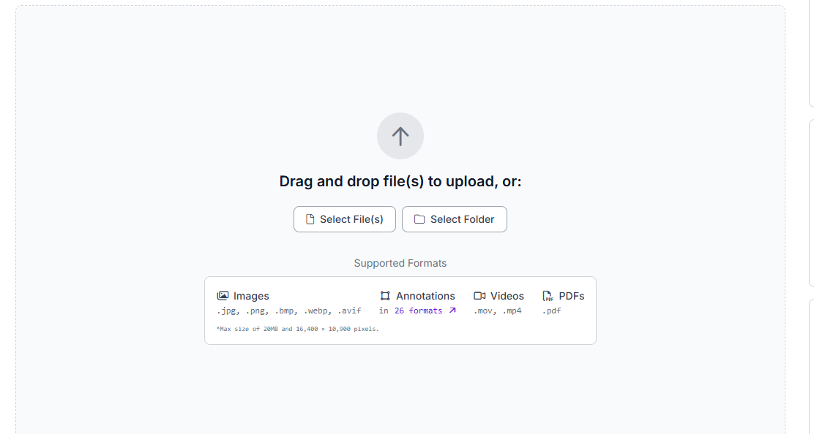
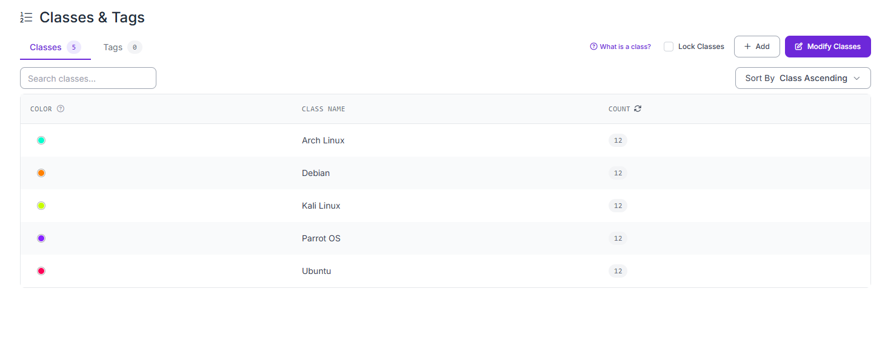
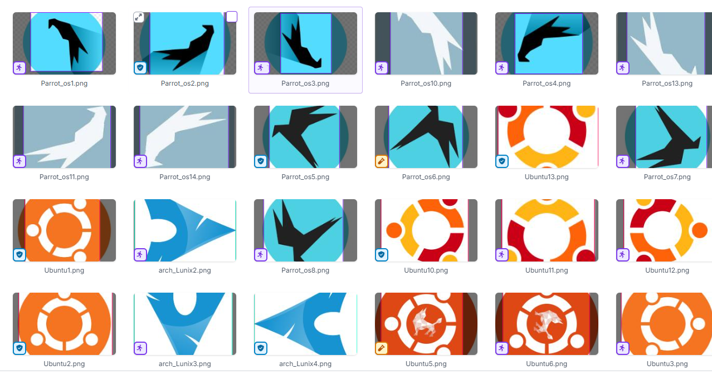
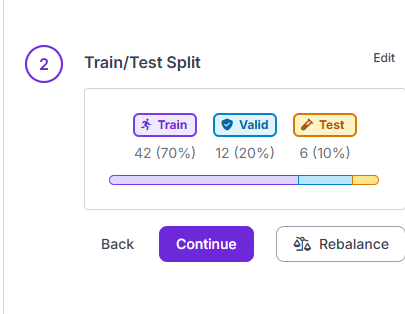

# 🧠 Entrenamiento de modelo YOLO con RoboFlow y Google Colab

---

## 1. 📁 RoboFlow

Como primer paso utilizaremos **RoboFlow** para crear el dataset que será usado por YOLO durante el entrenamiento.

### 🔹 Creación del proyecto
Una vez creada la cuenta en RoboFlow:
- Creamos un nuevo proyecto
- Subimos las imágenes que vamos a utilizar

---
### 🔹 Creación de clases (etiquetas)
Luego nos dirigimos al apartado de **clases**, donde crearemos las etiquetas que se asignarán a cada imagen.

----
### 🔹 Anotación de imágenes
En el apartado de **anotaciones**, debemos etiquetar cada imagen manualmente, indicando qué objeto o clase representa.



---

### 🔹 Exportación del dataset
Una vez finalizadas las anotaciones:

- Vamos a la sección de **Versions**
- Exportamos el dataset para usarlo con YOLO

En esta sección también podemos observar la distribución de los datos:
- 70% → Entrenamiento  
- 10% → Validación / Pruebas  



---

## 2. 💻 Google Colab

Una vez finalizado el dataset en RoboFlow, utilizamos **Google Colab** para entrenar el modelo.

---
### 🔹 Instalación de librerías

Ya una vez finalizada la parte de roboflow nos ayudaremos de la herramienta de colab para hacer las pruebas necesarios.

- como primer paso instalaremos las librerias que necesitamos para comenzar a realizar las pruebas.

```python
!pip install roboflow ultralytics
```

---

### 🔹 Desgarca del dataset desde RoboFlow

- luego descargaremos el dataset que hemos hecho en roboflow.

```python
from roboflow import Roboflow
rf = Roboflow(api_key="keyxxx")
project = rf.workspace("trainyolo-2hzmz").project("train_yolo-bdfhb")
version = project.version(2)
dataset = version.download("yolov11")
```

----
### 🔹 cargar el modelo base YOLO

- para este paso se está utilizando un modelo base de YOLO previamente entrenado. Este modelo ya ha aprendido a reconocer múltiples objetos a partir de grandes conjuntos de datos. Al cargarlo, no se empieza desde cero, sino que se aprovecha ese conocimiento previo para adaptarlo a una nueva tarea mediante entrenamiento adicional.

```python
from ultralytics import YOLO
model = YOLO("yolo11s.pt")
```

---
### 🔹 configuración del data set


- El archivo data.yaml contiene la configuración del conjunto de datos que se utilizará para entrenar el modelo. En este archivo se especifican las rutas de las imágenes, así como las clases que el modelo debe aprender a reconocer.

```pythpn
data_path = "/content/train_yolo-2/data.yaml"
```

---
### 🔹 Entrenamiento del modelo

En esta etapa se entrena el modelo utilizando el conjunto de datos previamente definido. El parámetro epochs indica que el modelo recorrerá el dataset completo 15 veces para aprender los patrones de las imágenes. Por otro lado, imgsz=640 establece que todas las imágenes serán ajustadas a un tamaño de 640x640 píxeles, lo que permite un entrenamiento más uniforme.

```python
results = model.train(
    data=data_path,
    epochs=15,
    imgsz=640
)```
---